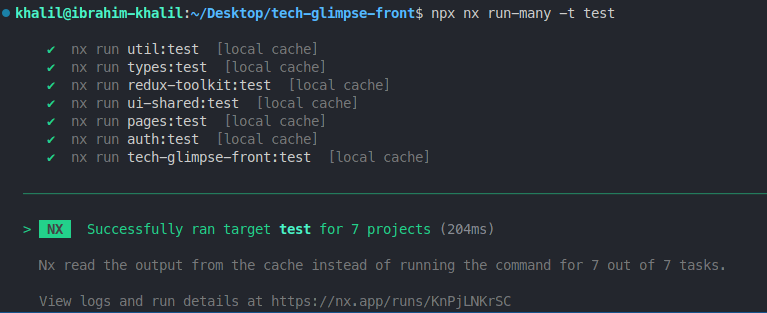
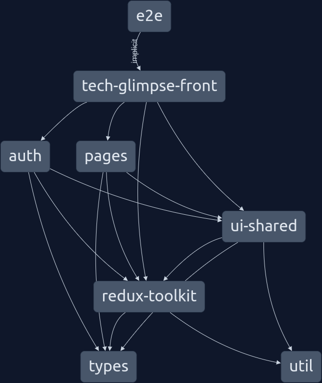

<h3 align="center">
  TechGlimpseFront
</h3> <br />

[![Contributors][contributors-shield]][contributors-url]
[![Stargazers][stars-shield]][stars-url]
[![MIT License][license-shield]][license-url]
[![LinkedIn][linkedin-shield]][linkedin-url]

## About The Project

<a alt="Nx logo" href="https://nx.dev" target="_blank" rel="noreferrer"></a>

✨ **This workspace has been generated by [Nx, a Smart, fast and extensible build system.](https://nx.dev)** ✨ <br/>

✨ **[Live Preview](https://tech-glimpse-front-8xq36z519-m-ibrahim-khalil.vercel.app)** ✨ <br/>

<h6>TechGlimpse is is a dedicated blogging platform where tech enthusiasts,
          developers, and learners come together to explore, share, and gain
          insights into the ever-evolving world of technology.</h6>

### Built With

- [![TypeScript][TypeScript.js]][TypeScript-url]
- [![React][React.js]][React-url]
- [![ReactQuery][ReactQuery.com]][ReactQuery-url]
- [![Redux][Redux.js]][Redux-url]
- [![Vite][Vite.io]][Vite-url]
- [![Jest][Jest.dev]][Jest-url]
- [![TailwindCSS][TailwindCSS.com]][TailwindCSS-url]

## Getting Started

### Prerequisites

- #### Backend:
  To serve the backend locally: Just follow the instruction of this [github repository](https://github.com/m-ibrahim-khalil/blogger-api-restful) .
- #### NPM

```sh
 npm install npm@latest -g
```

### Frontend Environment setup:

1. Clone this repository

```sh
   git clone https://github.com/m-ibrahim-khalil/techGlimpse-front.git
```

2. Change the project directory

```sh
   cd techGlimpse-front
```

3. Install the dependency

```sh
   npm install --save
```

## Start the app

To start the development server run `npx nx serve techGlimpseFront` or `npm start`. Open your browser and navigate to http://localhost:4200/. You will see a landing page like following:


## Unit Test

- ### Testing a specific module
  To start a unit test for auth module, run `npx nx run auth:test`
- ### Testing all the modules
  To start a unit test for all the modules, run `npx nx run-many -t test`
- ### Testing only the main app

  To start a unit test for the main App, run `npm test`

  

## Project Dependency Graph


To generate dependency graph, run `npx nx graph`

## Todo

- [ ] e2e testing: cypress
- [ ] Containerization
- [x] CI-CD
- [x] Deployment in vercel or renderer
- [x] Feature Improvement
- [x] Unit Testing

## License

Distributed under the MIT License. See `LICENSE.txt` for more information.

[contributors-shield]: https://img.shields.io/github/contributors/m-ibrahim-khalil/techGlimpse-front.svg?style=for-the-badge
[contributors-url]: https://github.com/m-ibrahim-khalil/techGlimpse-front/graphs/contributors
[stars-shield]: https://img.shields.io/github/stars/m-ibrahim-khalil/techGlimpse-front.svg?style=for-the-badge
[stars-url]: https://github.com/m-ibrahim-khalil/techGlimpse-front/stargazers
[license-shield]: https://img.shields.io/github/license/m-ibrahim-khalil/techGlimpse-front.svg?style=for-the-badge
[license-url]: https://github.com/m-ibrahim-khalil/techGlimpse-front/blob/master/LICENSE
[linkedin-shield]: https://img.shields.io/badge/-LinkedIn-black.svg?style=for-the-badge&logo=linkedin&colorB=555
[linkedin-url]: https://linkedin.com/in/ibrahim-khalil-89a250168
[TypeScript.js]: https://img.shields.io/badge/typescript-%23007ACC.svg?style=for-the-badge&logo=typescript&logoColor=white
[TypeScript-url]: https://www.typescriptlang.org/
[React.js]: https://img.shields.io/badge/React-20232A?style=for-the-badge&logo=react&logoColor=61DAFB
[React-url]: https://reactjs.org/
[Redux.js]: https://img.shields.io/badge/redux-%23593d88.svg?style=for-the-badge&logo=redux&logoColor=white
[Redux-url]: https://redux-toolkit.js.org/
[Vite.io]: https://img.shields.io/badge/vite-%23646CFF.svg?style=for-the-badge&logo=vite&logoColor=white
[Vite-url]: https://vitejs.dev/
[Jest.dev]: https://img.shields.io/badge/-jest-%23C21325?style=for-the-badge&logo=jest&logoColor=white
[Jest-url]: https://jestjs.io/
[ReactQuery.com]: https://img.shields.io/badge/-React%20Query-FF4154?style=for-the-badge&logo=react%20query&logoColor=white
[ReactQuery-url]: https://tanstack.com/query/v3/
[TailwindCSS.com]: https://img.shields.io/badge/Tailwind_CSS-38B2AC?style=for-the-badge&logo=tailwind-css&logoColor=white
[TailwindCSS-url]: https://tailwindcss.com/
